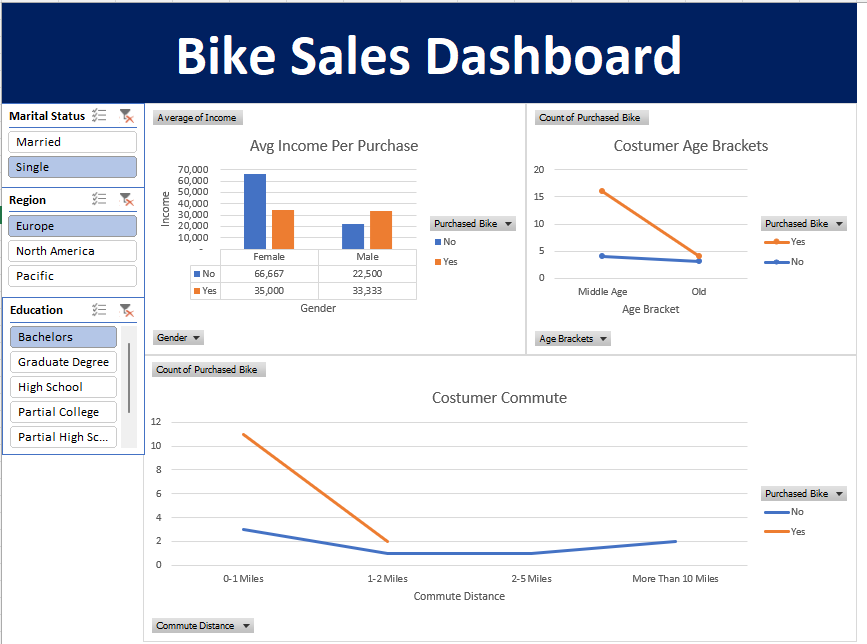

**🚴 Excel Project: Bike Purchase Data Analysis**

This repository contains the results of an Excel analysis project using the bike purchase dataset named Excel Project Dataset.xlsx.

---

**📂 Repository Contents**

* **Excel Project Dataset.xlsx** → main Excel file containing dataset and analysis.

* **README.md** → project documentation.

* **screenshot/** → contains Excel dashboard screenshots.

 * bike-sales-dashboard.png

* **data/ (optional)** → contains dataset files.

  * raw-data.xlsx → raw dataset before cleaning.

  * cleaned-data.xlsx → dataset after removing duplicates and applying find & replace.

* **docs/ (optional)** → contains additional reports.

  * report.pdf → PDF version of analysis summary.

  ---

**📑 About the Dataset**

The dataset contains bike purchase data with various customer information, such as:

* **Demographics** → age, gender, marital status.

* **Job & Income** → occupation, income.

* **Location** → region.

* **Transportation Habits** → car ownership, daily commute distance.

* **Bike Purchase** → whether a customer purchased a bike or not.

This dataset is suitable for analyzing consumer trends, customer segmentation, and factors influencing bike purchase decisions.

---

**🛠️ Data Preparation Steps**

Before creating PivotTables and the dashboard, several cleaning and transformation steps were performed:

**1. Remove Duplicates** → removed duplicate entries to ensure unique data.

**2. Find & Replace (Ctrl + H)** → standardized abbreviations into clear values, for example:

     M → Male

     F → Female

**3. Age Grouping** → used IF formulas to categorize customers into age brackets (Adolescent, Middle Age, Old).

**4. Data Formatting** → standardized text and order for clean and sorted charts/dashboards.

---

**🔎 Insights / Findings**

Some key findings from the bike purchase dashboard:

1. Average Income by Gender and Purchase Decision

2. Age Group Effect on Bike Purchase

3. Commute Distance vs. Bike Purchase

4. Data can also be further filtered by:

   * Marital Status (Single / Married)

   * Region (Europe, North America, Pacific)

   * Education (Partial High School, Partial College, High School, Graduate Degree, Bachelors)

These insights help identify the profile of potential customers and support more effective marketing strategies for bike sales.

---

**📷 Dashboard Preview**

Final visualization in Excel dashboard:

---

**🚀 How to Use**

1. Clone or download this repository.

2. Open Excel Project Dataset.xlsx using Microsoft Excel (2016 or later).

3. Go to the Dashboard sheet to explore the visualizations.

4. Use filters (Marital Status, Region, Education) to adjust the view.

--- 

**🛠 Tools Used**

Microsoft Excel → for data cleaning, transformation, PivotTables, and visualization.

